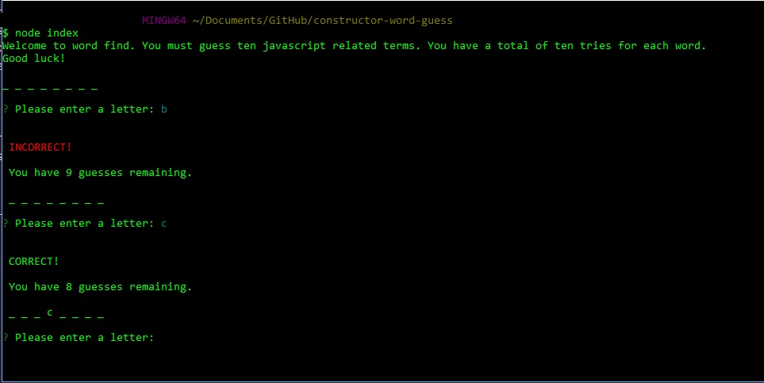
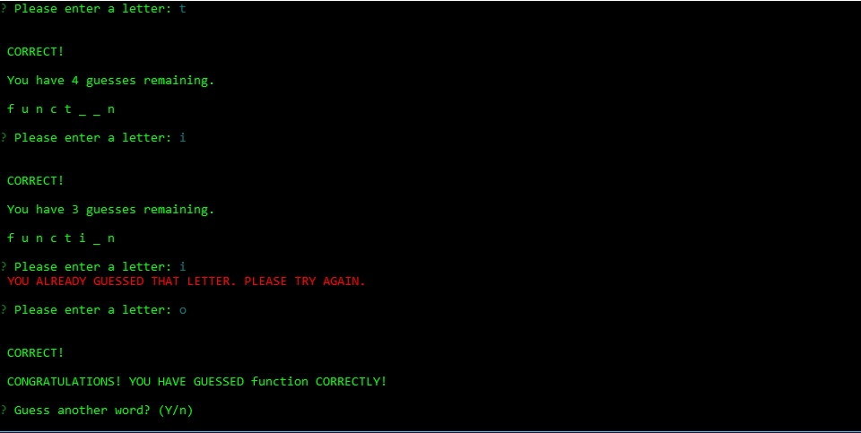
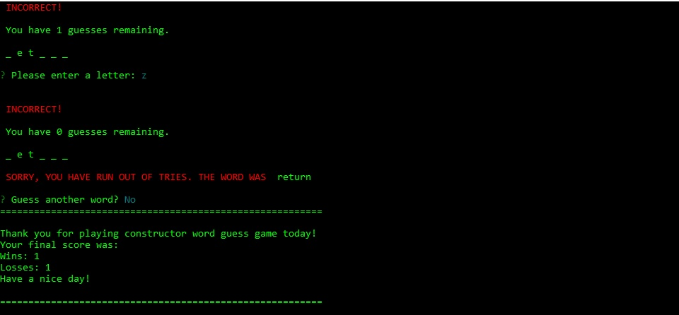

# constructor-word-guess
## Node.js command line word guess game
Play this javascript themed word guess game in your Command-line Interface console (Git Bash, CMD window, etc)

## NPM Dependencies
- Node Package manager: in the console, run npm init
- NPM Inquirer Module

## File Structure
- index.js: game logic file and primary gameplay module
- Word.js: constructor used by index.js to create a testable array of objects composed of individual letters in the word in play. It uses Letter.js to do this. It also creates a string that represents the current state of the word in play.
- Letter.js: constructor used by Word.js to create an individual object for each letter in the current word. Each object contains testing functionality to evaluate the state of the letter and return that state to the Word constructor.

## Gameplay
- In CLI, from directory of game files, run command: node index
- A word is chosen randomly from a list of ten words in an array
- Once a word is in play, it is removed from the array
- Player has ten attempts to guess the letters in the word
- If player exceeds ten guesses before getting the letters in the word, player is given the option to try another word
- If player guesses the letters in the word correctly, player is given the option to try another word
- Wins and Losses score is kept
- When word array is exhausted or player chooses to exit, game stats are displayed and game exits to command line
- Images of gameplay below

